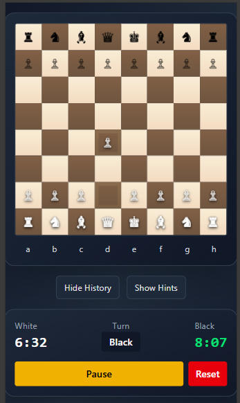

# ♟️ Chess Game

A chess game built with React and Tailwind CSS. Play against a friend, enjoy smooth animations, and experience a modern interface that adapts to any device.

---

## 🚀 Live Demo

👉 [Play the Chess Game Here](https://your-live-app-link.com)

---

## 🖼️ Preview



---

## ✨ Features

- Responsive design for all screen sizes
- Clean UI built with Tailwind CSS
- Real-time move updates

---

## 🧠 Tech Stack

- **React** — Frontend framework
- **Tailwind CSS** — Styling and layout
- **Vite** — Fast build and dev environment
- **TypeScript (optional)** — For type safety

---

## ⚙️ Setup & Installation

1. **Clone the repository**

   ```bash
   git clone https://github.com/ikennarichard/chess-game.git
   cd chess-game
   ```

2. **Install dependencies**

   ```bash
    npm install
   ```

3. **Run dev server**

   ```bash
   npm run dev
   ```

4. **Run dev server**

   ```bash
   Go to http://localhost:5173
   ```

## 🧑‍💻 Author

Richard Ikenna
Frontend Developer | UI Enthusiast

- [Portfolio](https://ikennaricahrd.vercel.app)

## 💖 Appreciation

Big thanks to everyone who inspired and supported this project!

- [Ania Kubow](https://www.codewithania.com) for her chess tutorial that sparked this journey. Her content was the foundation I built upon while adding my own logic.
